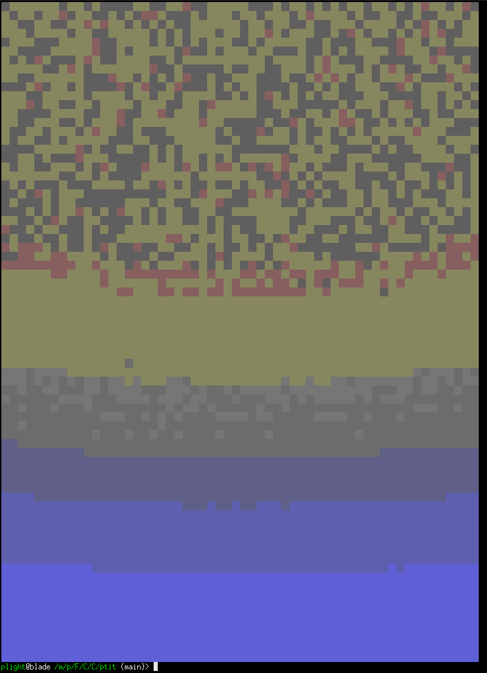

# ptit
> Put this in text

A CLI for turning images ~~or videos~~ into block text elements to view in the terminal

## Installation
### Cargo
> Requires a Rust install
```shell
cargo install ptit
```

## Usage
### URL
##### Input
```shell
cargo run -- -cr url "https://raw.githubusercontent.com/PokeAPI/sprites/master/sprites/pokemon/132.png"
```
##### Output
[]

### File
##### Input
```shell
cargo run -- -cr file "~/Downloads/63.png"
```
[]

## Flags
### Crop
Adding the `-c`/`--crop` flag will crop the image to it's content, removing all surrounding transparent pixels
#### Example
> Used in combination with `-r` to avoid large images
##### Without

##### With


### Resize
Using the `-r`/`--resize` flag will resize the image to fit to your terminal, either squashing or biggering the image
#### Example
> Used in combination with `-c` to avoid large images
##### Without

##### With


### Solid
Using the `-s`/`--solid` flag will stop dithering on pixels with an alpha of less than 255
> I had to use XTerm for these screenshots, hence bad colours
#### Example
##### Without

##### With

